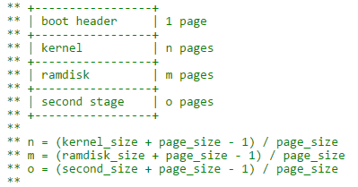

# Android uboot传递cmdline到内核原理

## 1. boot.img结构

boot.img由boot header参数、kernel、ramdisk和second stage组成。boot header占用1 page，其中包含了内核加载地址、ramdisk加载地址及cmdline等参数。

## 2. boot.img中的cmdline来源

boot.img中的cmdline参数是由android代码device下的BoardConfig.mk文件中变量BOARD_KERNEL_CMDLINE定义。在编译阶段，由build/core/Makefile将BOARD_KERNEL_CMDLINE变量读取出来，并传递给system/core/mkbootimg.c代码处理，在生成boot.img时写入到boot header相应的字段。

## 3. cmdline参数传递到内核

u-boot在启动boot.img时，执行booti boot命令，此时u-boot会跳转到do_booti函数中，将boot分区的boot.img信息读取出来，在读取cmdline后，还会将其他参数如androidboot.bootloader等参数一起追加在cmdline中，最后再将新的cmdline值写入bootargs中。启动内核时，将新的bootargs值传递给内核。

