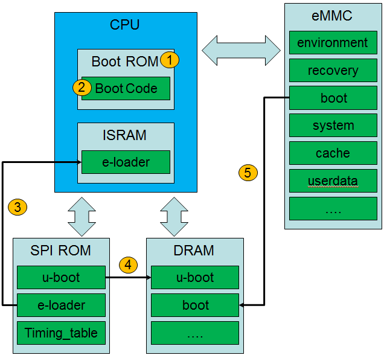
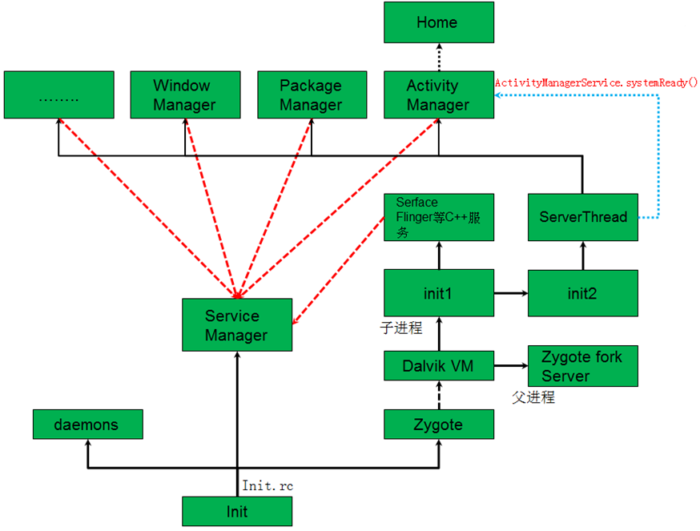
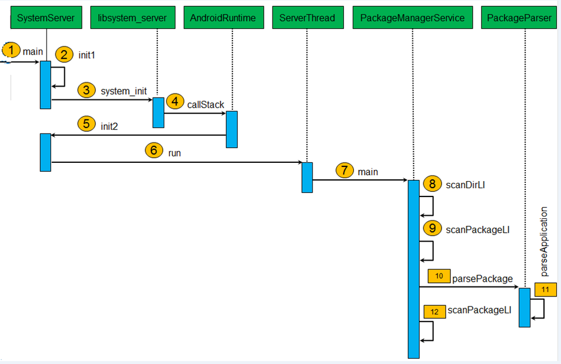
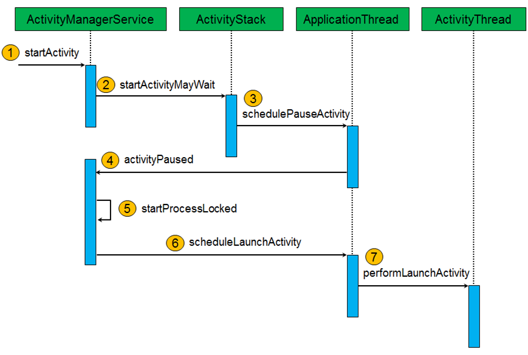
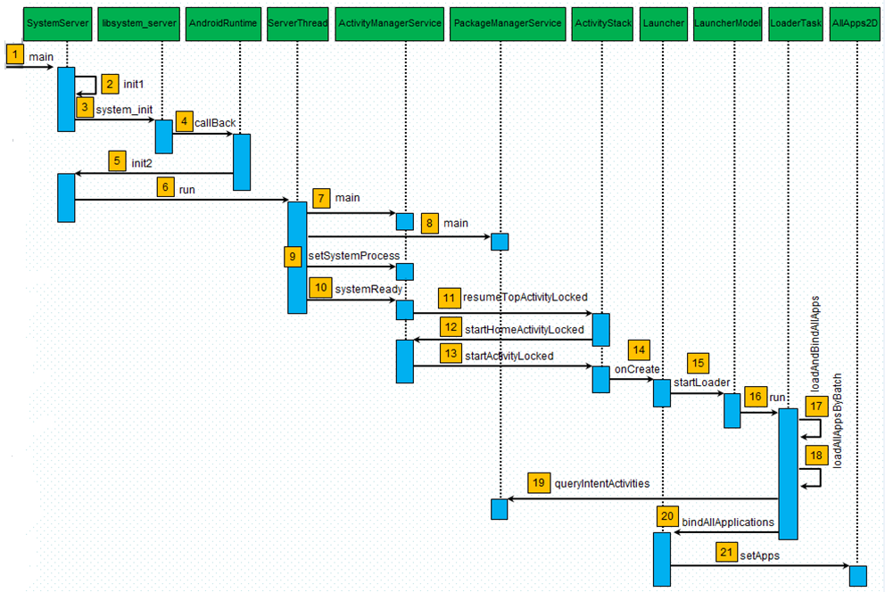

# Android启动流程分析

## 1. 内核启动流程分析

> 1、设备上电后，从Boot ROM开始运行；
>
> 2、Boot ROM中的代码初始化通信端口和可引导存储设备（SD/ eMMC/NAND）；
>
> 3、Boot Code将SPI ROM中的e-loader加载到内部ISRAM，并跳转到e-loader入口执行；
>
> 4、e-loader在初始化完DRAM后，将SPI ROM中的u-boot加载到DRAM，并跳转到u-boot入口执行；
>
> 5、u-boot代码初始化eMMC后，将eMMC中的boot加载到DRAM，并启动内核；

## 2. Android系统启动流程

> 1、内核在执行Init进程时，会分别启动守护进程、服务器管理进程和Zygote进程；
>
> 2、Zygote进程会初始化并实例化Dalvik虚拟机；接着执行ZygoteInit.java代码，打开监听，并在主进程中无线循环接收命令创建新进程；ZygoteInit还会创建子进程以执行SystemServer.java,从而启动C++服务及Java实现的管理服务，并注册到服务管理器中；
>
> 3、服务启动完后，ServerThread会给ActivityManagerService发送系统就绪通知，当ActivityManagerService收到系统就绪通知后，会启动Home应用程序；

## 3. Android系统启动时应用程序安装过程

Android系统在启动的过程中，Zygote进程会启动一个应用程序管理服务PackageManagerService，这个服务负责扫描系统中特定的目录，找到里面的应用程序文件，即以Apk为后缀的文件，然后对这些文件进解析，得到应用程序的相关信息，最终完成应用程序的安装过程。

> 1、Zygote进程在创建子进程后，执行SystemServer.java的main方法；
>
> 2、在main方法中调用init1方法，该方法通过JNI实现；
>
> 3、init1方法中会调用libsystem_server库中的system_init函数，从而初始化surfaceFlinger、sensorService、audioFlinger、mediaPlayerService、cameraService和audioPolicyService这些C++实现的服务；
>
> 4、在system_init中，还会通过全局唯一的AndroidRuntime实例变量runtime来调用callStack；
>
> 5、在callStack中再调用SystemServer的init2方法；
>
> 6、在init2中创建ServerThread线程，并启动该线程，从而执行run方法；
>
> 7、在ServerThread线程中，会启动一系列Java实现的管理服务，其中就包括PackageManagerService，通过执行PackageManagerService的main方法，从而创建对应服务的实例，并将该服务添加到服务管理器中；
>
> 8、在实例化PackageManagerService时，其构造方法中会执行安装应用程序的过程，首先通过scanDirLI方法来扫面系统目录下的APK安装文件，扫描目录包括： /system/framework、/system/app、/vendor/app、/data/app和/data/app-private；
>
> 9、在scanDirLI中，对目录中的每一个APK文件，都会调用scanPackageLI对其进行解析和安装；
>
> 10、在scanPackageLI中，会对应APK创建PackageParser实例，并调用实例的parsePackage先得到APK文件中的AndroidManifest.xml文件，再调用另一个版本的parsePackage对AndroidManifest.xml文件进行解析；
>
> 11、在另一个版本的parsePackage中，会通过调用parseApplication对application标签进行解析；
>
> 12、在执行完10和11步骤后，继续回到步骤9中，并在scanPackageLI中调用另一个版本的scanPackageLI，把解析得到的package、provider、service、receiver和activity等信息保存在PackageManagerService服务中；

当以上这些流程运行完成后，Android系统启动时安装应用程序过程已近完成，此时，这些应用程序只相当于在PackageManagerService中注册完成，但还需要Home应用程序将PackageManagerService中注册好的应用程序取出来，并呈现在桌面上。

## 4. Android应用程序启动过程

> 1、无论是launcher启动Activity，还是通过Activity内部调用启动新的Activity，都需要通过Binder通信到ActivityManagerService进程中调用ActivityManagerService.startActivity接口；
>
> 2、ActivityManagerService调用ActivityStack.startActivityMayWait来做准备要启动的Activity相关信息；
>
> 3、ActivityStack通知ApplicationThread进程要进行Activity调度了。ApplicationThread进程表示launcher进程或原Activity所在进程；
>
> 4、ApplicationThread进程不执行真正的启动操作，通过Binder通信调用ActivityManagerService.activityPaused接口进入到ActivityManagerService进程中，看是否需要创建新的进程；
>
> 5、通过点击应用图标方式启动Activity，则需要在ActivityManagerService中调用startProcessLocked创建新的进程；若是在原Activity中启动新的Activity，则不需要再创建新的进程；
>
> 6、ActivityManagerService调用ApplicationThread.scheduleLaunchActivity接口，通知相应进程执行启动Activity的操作；
>
> 7、ApplicationThread把启动Activity的操作转发给ActivityThread，ActivityThread通过ClassLoader导入相应Activity类，然后把它启动起来；

## 5. Launcher启动过程

Android系统的Home应用程序Launcher是由ActivityManagerService服务启动的，该服务和PackageManagerService服务一样，都是在开机时由SystemServer组件启动的

> 1~7跟前文《Android系统启动时应用程序安装过程》的1~7步骤一样；
>
> 9、在执行setSystemProcess时，首先将ActivityManagerService服务注册到服务管理器中，然后调用installSystemApplication将应用程序框架层下面的Android包加载进来；
>
> 10、在ServerThread将一系列服务初始化完成后，会通过调用systemReady告诉ActivityManagerService系统已经就绪；
>
> 11、在systemReady中，会调用resumeTopActivityLocked来启动Home应用程序；
>
> 12、在resumeTopActivityLocked中，由于返回顶端的Activity为null，因此会调用startHomeActivityLocked，该方法会创建CATEGORY_HOME类型的Intent，然后通过Intent的resolveActivityInfo在PackageManagerService中查询同类型的Activity；
>
> 13、在startHomeActivityLocked中，因第一次启动该Activity，故会调用startActivityLocked来启动Launcher的Activity；
>
> 14、在执行startActivityLocked时，接着会调用Launcher Activity的onCreate方法；
>
> 15~21将已安装的应用加载进来，并在桌面上显示这些应用；

